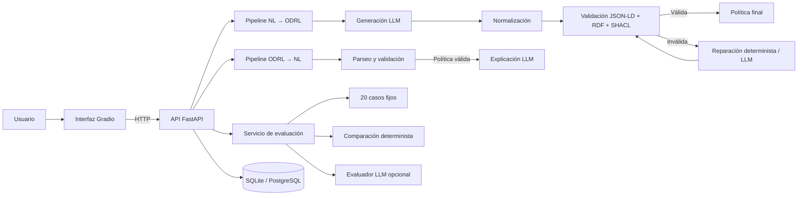

# ODRL Translator

**Traducción bidireccional entre lenguaje natural y políticas ODRL serializadas en JSON-LD**

[Python](https://www.python.org/)
[FastAPI](https://fastapi.tiangolo.com/)
[Gradio](https://www.gradio.app/)
[Docker](https://www.docker.com/)
[Kubernetes](https://kubernetes.io/)
[ODRL](https://www.w3.org/TR/odrl-model/)

Prototipo académico que utiliza modelos de lenguaje para reducir la barrera de entrada a ODRL, incorporando generación estructurada, normalización, validación SHACL, reparación automática, persistencia y evaluación reproducible.

## Descripción

ODRL Translator permite transformar una política expresada en lenguaje natural en una política ODRL JSON-LD estructurada y realizar el proceso inverso, generando una explicación comprensible a partir de una política formal.

La aplicación no se limita a invocar un modelo de lenguaje. La salida generada atraviesa un pipeline completo que normaliza la estructura, valida el documento, intenta reparar los errores detectados y conserva información de trazabilidad sobre la ejecución.

La solución se divide en dos componentes desacoplados:

- una **API FastAPI**, que concentra toda la lógica de negocio, validación, persistencia y evaluación;
- una **interfaz Gradio**, que consume exclusivamente la API mediante HTTP.

---

## Arquitectura




### Principios de diseño

1. **Separación de responsabilidades.** La interfaz no accede directamente al modelo, los validadores ni la base de datos.
2. **Validación antes de interpretación.** Una política ODRL inválida no se envía al LLM para generar su explicación.
3. **Reparación trazable.** Se conserva la política previa, los cambios aplicados, el número de intentos y el motivo de parada.
4. **Evaluación diferenciada.** La validez estructural, la conformidad SHACL y la coincidencia semántica se miden por separado.
5. **Despliegue reproducible.** La misma aplicación puede ejecutarse localmente, en contenedores o en Kubernetes.

---

## Subconjunto ODRL cubierto

El prototipo utiliza un perfil ODRL atómico y deliberadamente más estricto que el modelo ODRL completo.


| Categoría                | Elementos principales                                                                                                                                                                 |
| ------------------------ | ------------------------------------------------------------------------------------------------------------------------------------------------------------------------------------- |
| Tipos de política        | `Policy`, `Set`, `Offer`, `Agreement`, `Request`                                                                                                                                      |
| Tipos de regla           | `permission`, `prohibition`, `obligation`                                                                                                                                             |
| Partes y activos         | `target`, `assigner`, `assignee`                                                                                                                                                      |
| Requisitos asociados     | `duty`, `remedy`, `consequence`                                                                                                                                                       |
| Acciones                 | `use`, `read`, `modify`, `distribute`, `delete`, `display`, `print`, `copy`, `archive`, `derive`, `extract`, `transform`, `aggregate`, `anonymize`, `attribute`, `compensate`, `sell` |
| Operadores               | `eq`, `neq`, `lt`, `lteq`, `gt`, `gteq`                                                                                                                                               |
| Operandos principales    | `purpose`, `dateTime`, `elapsedTime`, `spatial`, `recipient`, `count`, `payAmount`                                                                                                    |
| Resolución de conflictos | `prohibit`, `perm`, `invalid`                                                                                                                                                         |


Las políticas se normalizan en reglas atómicas: cada regla contiene un único `target`, `assigner`, `assignee` y `action` cuando dichos elementos están presentes.

---

## Tecnologías


| Capa                          | Tecnología                        |
| ----------------------------- | --------------------------------- |
| Lenguaje                      | Python 3.12                       |
| Interfaz                      | Gradio                            |
| API                           | FastAPI + Uvicorn                 |
| Orquestación LLM              | LangChain / LCEL                  |
| Proveedor LLM                 | OpenAI                            |
| Validación semántica          | RDFLib + PySHACL                  |
| Persistencia                  | SQLAlchemy                        |
| Base de datos local           | SQLite                            |
| Base de datos en contenedores | PostgreSQL 16                     |
| Pruebas                       | Pytest                            |
| Contenedores                  | Docker + Docker Compose           |
| Orquestación                  | Kubernetes + Kustomize + Minikube |
| CI/CD                         | GitHub Actions + GHCR             |


---

## Ejecución y despliegue

> **Guía completa:** consulta [DEPLOY.md](DEPLOY.md) para los requisitos, la configuración de secretos, la persistencia, las actualizaciones, las copias de seguridad, el rollback y la resolución de problemas.

La aplicación admite tres formas principales de ejecución:


| Modalidad                                     | Dónde se ejecuta                 | Origen de las imágenes                              | Comando principal                |
| --------------------------------------------- | -------------------------------- | --------------------------------------------------- | -------------------------------- |
| **Docker Compose local**                      | Docker en la máquina local       | Se construyen desde el código del repositorio       | `docker compose up --build`      |
| **Kubernetes local**                          | Minikube en la máquina local     | Se construyen localmente y se cargan en Minikube    | `./deploy.sh --local`            |
| **Kubernetes con imágenes de GitHub Actions** | Minikube o un clúster Kubernetes | Se descargan desde GitHub Container Registry (GHCR) | `GH_USER='juliiosp' ./deploy.sh` |


GitHub Actions ejecuta las pruebas, construye las imágenes para `linux/amd64` y `linux/arm64` y las publica en GHCR con las etiquetas `latest` y `sha-<commit>`. El workflow **publica imágenes, pero no despliega automáticamente la aplicación**.

### Opción 1: ejecución local con Docker Compose

Requiere Docker Desktop o Docker Engine con Docker Compose.

```bash
cp .env.example .env
```

Configura al menos estas variables en `.env`:

```dotenv
OPENAI_API_KEY=tu_clave
POSTGRES_PASSWORD=una_contraseña_segura
```

Construye e inicia PostgreSQL, FastAPI y Gradio:

```bash
docker compose up --build
```

Para ejecutarlo en segundo plano:

```bash
docker compose up --build -d
```

Acceso:

- interfaz: `http://localhost:7860`;
- API y Swagger: `http://localhost:8000/docs`.

Detención:

```bash
docker compose down
```

La configuración completa de Docker Compose se explica en la [Parte I de](DEPLOY.md#parte-i-despliegue-con-docker-compose) `DEPLOY.md`.

### Opción 2: Kubernetes local con imágenes construidas en el equipo

Este modo construye `odrl-translator-api:local` y `odrl-translator-ui:local`, las carga en Minikube y despliega la aplicación mediante Kustomize.

Requiere Docker, `kubectl` y Minikube:

```bash
export OPENAI_API_KEY='tu_clave'
export POSTGRES_PASSWORD='una_contraseña_segura'

./deploy.sh --local
```

Al finalizar, el script abre la interfaz mediante `port-forward` en:

```text
http://localhost:8080
```

Este modo no utiliza las imágenes de GHCR. Es el recomendado para probar cambios locales antes de subirlos al repositorio.

La explicación completa está en la [opción de imágenes locales de](DEPLOY.md#14-opción-a-construir-las-imágenes-localmente) `DEPLOY.md`.

### Opción 3: Kubernetes con imágenes publicadas por GitHub Actions

Este modo no construye las imágenes en el equipo. Minikube descarga desde GHCR las imágenes publicadas por el workflow de GitHub Actions:

```text
ghcr.io/juliiosp/tfm-traductor-bidireccional-odrl-api:latest
ghcr.io/juliiosp/tfm-traductor-bidireccional-odrl-ui:latest
```

Las imágenes deben ser públicas o el clúster debe disponer de credenciales para GHCR.

```bash
export OPENAI_API_KEY='tu_clave'
export POSTGRES_PASSWORD='una_contraseña_segura'

GH_USER='juliiosp' ./deploy.sh
```

Al finalizar, la interfaz queda disponible en:

```text
http://localhost:8080
```

Este modo permite validar exactamente los artefactos generados por CI/CD. La explicación completa está en la [opción GHCR de](DEPLOY.md#15-opción-b-utilizar-imágenes-publicadas-en-ghcr) `DEPLOY.md`.

> El comando anterior utiliza **imágenes remotas** de GHCR, aunque el clúster sea Minikube local. Para desplegar las mismas imágenes en un clúster Kubernetes verdaderamente remoto, consulta la [aplicación manual de manifiestos](DEPLOY.md#parte-iii-aplicación-manual-de-los-manifiestos) y la sección sobre [registros privados](DEPLOY.md#26-registro-privado-de-contenedores).


### Retirar el despliegue de Kubernetes

```bash
./teardown.sh
```

Este comando elimina el namespace `odrl`, incluidos los pods, servicios, secretos y el volumen de PostgreSQL, pero mantiene Minikube en ejecución. También están disponibles:

```bash
./teardown.sh --stop
./teardown.sh --delete-cluster
```

Consulta todos los detalles en `[DEPLOY.md](DEPLOY.md)`.

---

## Desarrollo local sin contenedores

Esta modalidad está orientada al desarrollo y la ejecución directa del código Python. Para los despliegues con contenedores o Kubernetes, consulta `[DEPLOY.md](DEPLOY.md)`.

### Requisitos

- Python 3.12.
- Una clave de API de OpenAI para las operaciones que utilizan un LLM.
- PostgreSQL opcional. Si no se define `DATABASE_URL`, la API utiliza SQLite.


### Preparar el entorno

```bash
python -m venv .venv
source .venv/bin/activate
python -m pip install --upgrade pip
python -m pip install -r requirements.txt
```

En Windows PowerShell:

```powershell
.venv\Scripts\Activate.ps1
```

### Configurar y arrancar la aplicación

```bash
export OPENAI_API_KEY='tu_clave'
export OPENAI_MODEL='gpt-4.1-mini'
export DATABASE_URL='sqlite:///./odrl_translator.db'
```

Inicia la API:

```bash
uvicorn app.api.app:app --host 0.0.0.0 --port 8000 --reload
```

En otra terminal, con el mismo entorno virtual activado, inicia la interfaz:

```bash
export API_BASE_URL='http://127.0.0.1:8000'
python -m app.ui
```

La interfaz estará disponible en `http://localhost:7860` y la documentación de la API en `http://localhost:8000/docs`.

---

## Uso de la interfaz

La interfaz contiene cinco áreas principales:

1. **Natural Language → ODRL**: genera, normaliza, valida y, opcionalmente, repara una política.
2. **ODRL → Natural Language**: valida una política y genera una explicación cuando es conforme.
3. **Evaluation**: ejecuta los 20 casos fijos y permite inspeccionar el resultado de cada uno.
4. **Stats**: muestra métricas globales, gráficas, cobertura y casos que requieren revisión.
5. **Translation History**: consulta y elimina las traducciones persistidas.

---

## Ejemplo de traducción

Entrada:

```text
DataProviderA grants ResearchLabA permission to use Dataset1 only for research purposes.
```

Salida representativa:

```json
{
  "@context": "http://www.w3.org/ns/odrl.jsonld",
  "@type": "Agreement",
  "uid": "http://example.com/policy/Dataset1ResearchAgreement",
  "permission": [
    {
      "target": "http://example.com/asset/Dataset1",
      "assigner": "http://example.com/party/DataProviderA",
      "assignee": "http://example.com/party/ResearchLabA",
      "action": "use",
      "constraint": [
        {
          "leftOperand": "purpose",
          "operator": "eq",
          "rightOperand": "research"
        }
      ]
    }
  ]
}
```

La salida concreta depende del modelo seleccionado, pero debe satisfacer las reglas del perfil y superar la validación configurada.

---

## API REST

La especificación interactiva completa está disponible en `/docs`.


| Método   | Endpoint                       | Descripción                                                       |
| -------- | ------------------------------ | ----------------------------------------------------------------- |
| `GET`    | `/health`                      | Comprueba que el proceso de la API está activo.                   |
| `GET`    | `/ready`                       | Comprueba la conexión con la base de datos.                       |
| `POST`   | `/api/v1/translate/nl-to-odrl` | Genera y valida una política ODRL.                                |
| `POST`   | `/api/v1/translate/odrl-to-nl` | Valida una política y genera su explicación.                      |
| `POST`   | `/api/v1/validate`             | Ejecuta la validación sin llamar al LLM.                          |
| `POST`   | `/api/v1/evaluation/run`       | Ejecuta la batería fija de evaluación.                            |
| `GET`    | `/api/v1/history?limit=10`     | Devuelve las traducciones más recientes. El límite máximo es 100. |
| `DELETE` | `/api/v1/history`              | Elimina todo el historial almacenado.                             |


### Generar una política

```bash
curl -X POST 'http://localhost:8000/api/v1/translate/nl-to-odrl' \
  -H 'Content-Type: application/json' \
  -d '{
    "text": "CompanyA may use Dataset1 only for research purposes.",
    "model": "gpt-4.1-mini",
    "repair_enabled": true
  }'
```

La respuesta incluye la política final, el informe de validación, la información de reparación, el número de llamadas al modelo y la duración total.

### Validar sin utilizar el LLM

```bash
curl -X POST 'http://localhost:8000/api/v1/validate' \
  -H 'Content-Type: application/json' \
  -d '{
    "policy": {
      "@context": "http://www.w3.org/ns/odrl.jsonld",
      "@type": "Set",
      "uid": "http://example.com/policy/TestPolicy",
      "permission": [
        {
          "target": "http://example.com/asset/Dataset1",
          "assignee": "http://example.com/party/CompanyA",
          "action": "use"
        }
      ]
    }
  }'
```

---

## Pipeline de traducción y reparación

### Lenguaje natural → ODRL

1. Construcción del prompt y generación de JSON mediante el LLM.
2. Parseo de la salida estructurada.
3. Normalización de contenedores y reglas.
4. Validación del contexto JSON-LD.
5. Conversión local a RDF sin depender de la descarga remota del contexto ODRL.
6. Validación frente al grafo de formas SHACL.
7. Si la política es inválida y la reparación está habilitada:
  - aplicación de correcciones deterministas;
  - nueva validación;
  - reparación asistida por LLM cuando las correcciones deterministas no bastan;
  - repetición hasta validar, alcanzar el límite o detectar ausencia de progreso.
8. Persistencia del resultado y de las trazas principales.

### ODRL → lenguaje natural

1. Parseo del documento JSON.
2. Validación JSON-LD y SHACL.
3. Generación de la explicación únicamente cuando la política es válida.
4. Persistencia del resultado o del error de validación.

---

## Evaluación

La batería de evaluación contiene 20 casos fijos que cubren permisos, prohibiciones, obligaciones, duties, tipos de política, restricciones temporales, espaciales, de propósito y de cardinalidad, además de políticas mixtas.

Para cada caso se conservan:

- respuesta cruda del modelo;
- política generada;
- política normalizada;
- política reparada, cuando existe;
- versión final utilizada;
- informes de validación;
- cambios introducidos por la reparación;
- explicación generada en lenguaje natural;
- comparación con los elementos ODRL esperados;
- puntuaciones del evaluador LLM, cuando está habilitado.

### Métricas

- JSON válido.
- Prevalidación JSON-LD superada.
- Validez en el primer intento.
- Conformidad SHACL final.
- Reparaciones intentadas y aplicadas.
- Coincidencia semántica determinista.
- Resultados agrupados por tipo de regla y tipo de política.
- Cobertura esperada del subconjunto ODRL.
- Medias del evaluador LLM opcional:
  - validez estructural;
  - fidelidad semántica;
  - completitud;
  - claridad.

La cobertura representa los elementos incluidos en el diseño de la batería. No implica que todos hayan sido generados correctamente en una ejecución concreta.

---

## Pruebas

```bash
python -m compileall -q app tests
pytest -q
```

La suite cubre:

- endpoints operativos, validación e historial de la API;
- normalización y atomicización de políticas;
- reparación determinista de operandos tipados;
- validación JSON-LD y SHACL;
- comparación determinista de los resultados de evaluación.

Las pruebas unitarias no necesitan una clave de OpenAI porque no ejecutan los pipelines de generación reales.

---

## Estructura del proyecto

```text
.
├── app/
│   ├── api/                     # Aplicación FastAPI y modelos HTTP
│   ├── database/                # SQLAlchemy, modelo y operaciones de persistencia
│   ├── evaluation/              # Casos fijos y expectativas deterministas
│   ├── schemas/                 # Contratos internos con Pydantic
│   ├── services/                # Pipelines, inferencia, evaluación y cliente HTTP
│   ├── validator/               # Validación JSON-LD, RDF, SHACL y shapes
│   ├── web/                     # Interfaz Gradio
│   ├── config.py                # Configuración mediante variables de entorno
│   ├── prompts.py               # Prompts de generación, reparación y evaluación
│   └── ui.py                    # Punto de entrada de la interfaz
├── tests/                       # Pruebas automáticas
├── k8s/                         # Manifiestos de Kubernetes y Kustomize
├── .github/workflows/ci-cd.yml  # Integración continua y publicación de imágenes
├── Dockerfile.api               # Imagen de la API
├── Dockerfile.ui                # Imagen de la interfaz
├── docker-compose.yml           # Entorno local completo
├── deploy.sh                    # Automatización de Minikube
├── teardown.sh                  # Retirada del entorno Kubernetes
├── DEPLOY.md                    # Guía única de despliegue y operación
└── requirements.txt             # Dependencias Python
```

---

## Persistencia y trazabilidad

Cada traducción puede almacenar:

- dirección de traducción;
- entrada y salida;
- estado final y mensaje de error;
- modelo utilizado;
- activación y aplicación de la reparación;
- política original anterior a la reparación;
- cambios y número de intentos;
- motivo de parada;
- número de llamadas al LLM;
- duración total;
- informe SHACL;
- fecha de creación.

En ejecución local se puede utilizar SQLite. Docker Compose y Kubernetes utilizan PostgreSQL compartido.

---

## Seguridad y alcance

Este repositorio es un **prototipo académico**. La validación confirma la conformidad con el perfil SHACL definido por el proyecto, pero no cubre todo el modelo ODRL ni constituye una validación jurídica.

La aplicación no debe exponerse públicamente sin autenticación, control de acceso, límites de consumo, TLS, protección de secretos y una política de privacidad y retención del historial. Las medidas operativas y la lista de comprobación para producción se describen exclusivamente en `[DEPLOY.md](DEPLOY.md)`.

No incluyas `.env`, claves, contraseñas ni manifiestos con secretos reales en Git o en paquetes de entrega.

---

## Contexto académico

Proyecto desarrollado como Trabajo Fin de Máster por **Julio Sánchez-Pajares Aliseda** en 2026, centrado en la traducción semántica de políticas mediante modelos de lenguaje, ODRL, JSON-LD, RDF, SHACL y LangChain.
